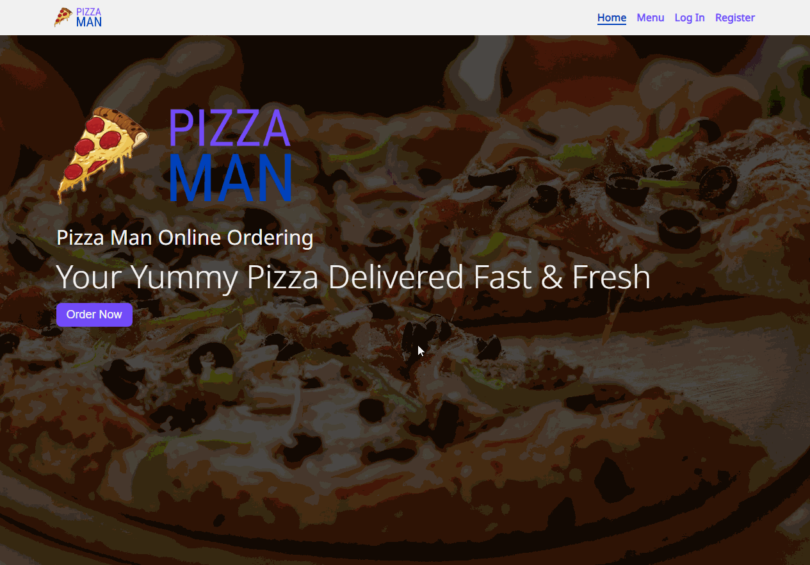

# Pizza Delivery


_Pizza Delivery — an interactive and responsive web application providing users with a convenient online pizza ordering service, used the Single Page Application (SPA) architectural approach._


# [View Demo](https://andrewvoloshin.github.io/Website-Pizza-Vue/) 


## Features:

- **Technologies used**: Vue 2, Vuex, Vue Router, Vuelidate.
-	Users can browse the menu, select, and order pizzas online.
-	The site adapts to different devices, ensuring comfortable use on PCs, tablets and smartphones.
-	Ability to manually place ships.
-	Easy to navigate burger menu is available on mobile devices.
-	Interactive forms with data validation using Vuelidate.
-	Application state management with Vuex for efficient and centralised data storage.


## How to Use

### Clone the repository:
```bash
   git clone https://github.com/AndrewVoloshin/Website-Pizza-Vue.git
   cd Website-Pizza-Vue
```
###  Install dependencies and run the project:

```bash
   npm install
   npm run serve
```
Open http://localhost:8080 in your browser to view the application.


## Demonstration


